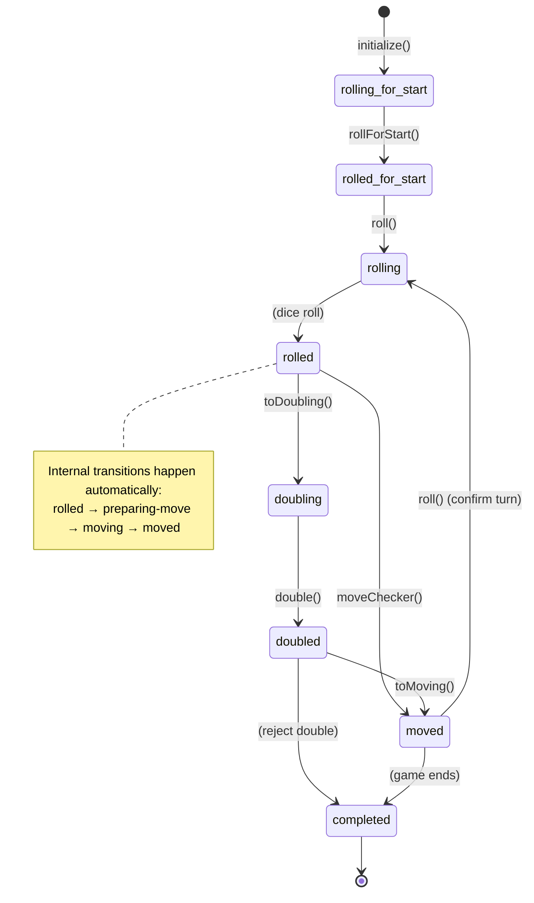

# Backgammon Game State Lifecycle

This document provides a comprehensive overview of the backgammon game state lifecycle, including the state transitions and the methods responsible for each transition.

## State Diagram

> **Note**: If the diagram below doesn't render properly, your markdown viewer may not support Mermaid diagrams. Consider using GitHub, GitLab, or a Mermaid-compatible viewer.



### Alternative Text-Based Flow

If the diagram above doesn't render, here's the state flow in text format:

```
[Start]
   ↓ API: /games (POST)
rolling-for-start
   ↓ rollForStart() (automatic)
rolled-for-start
   ↓ API: /games/:id/roll (user clicks dice)
rolling
   ↓ (dice roll)
rolled
   ↓ API: /games/:id/move OR /games/:id/double
moved                 doubling
   ↓ API: /games/:id/roll  ↓ API: /games/:id/double
   (user clicks dice)   doubled
rolling OR completed    ↓ API: accept/reject-double
   ↓                   moving OR completed
[End]                     ↓
                       moved
                          ↓ API: /games/:id/roll
                          (user clicks dice)
                       rolling OR completed
```

**Note**: The intermediate states ('preparing-move' → 'moving') happen automatically inside the API and are not visible to users.

## State Descriptions

- **`rolling-for-start`** - Initial state when game is created
- **`rolled-for-start`** - After initial roll to determine which player goes first
- **`rolling`** - Player about to roll dice for their turn
- **`rolled`** - Player has rolled dice and can choose next action
- **`preparing-move`** - Player has chosen to make a move (vs doubling)
- **`doubling`** - Player is offering a double
- **`doubled`** - Cube has been doubled, waiting for opponent response
- **`moving`** - Player is actively moving checkers on the board
- **`moved`** - Player has completed their move for this turn
- **`completed`** - Game has ended with a winner determined

## User Interaction Flow

This section maps human user interactions (UI events) to the corresponding API calls that trigger state transitions:

### Initial Game Setup

```
'rolling-for-start' → **API: Game.createNewGame()** → Game.rollForStart() (automatic) → 'rolled-for-start'
'rolled-for-start' → **user clicks dice** → API: /games/:id/roll → Game.roll() → 'rolled'
```

**Note**: The `rollForStart()` method is called automatically during game creation with `autoRollForStart: true`. Users do not manually trigger the initial roll for start - it happens when the game is created via the API.

### Player Turn Flow

```
'rolling' → **user clicks dice** → API: /games/:id/roll → (automatic dice roll) → 'rolled'
'rolled' → **user clicks checker** → API: /games/:id/move → Move.moveChecker() → 'moved' (automatic)
'rolled' → **user clicks cube** → API: /games/:id/double → Game.toDoubling() → 'doubling'
```

### Internal State Transitions (Automatic)

When `Move.moveChecker()` is called, it performs these transitions internally:

```
'rolled' → prepareMove() → 'preparing-move' → toMoving() → 'moving' → move() → 'moved'
```

### Turn Completion

```
'moved' → **user clicks dice (confirm turn)** → API: /games/:id/roll → 'rolling' (next player) OR 'completed' (game end)
```

**Note**: The `prepareMove()`, `toMoving()`, and `move()` methods are all called automatically within the `Move.moveChecker()` API. Users simply click a checker and the entire sequence executes automatically, transitioning from 'rolled' directly to 'moved'.

### Doubling Cube Actions

```
'preparing-move' → **user clicks cube** → API: /games/:id/double → Game.toDoubling() → 'doubling'
'doubling' → **user confirms double** → API: /games/:id/double → Game.double() → 'doubled'
'doubled' → **opponent accepts** → API: /games/:id/accept-double → Game.toMoving() → 'moving'
'doubled' → **opponent rejects** → API: /games/:id/reject-double → (automatic) → 'completed'
```

### Robot/AI Players

For robot players, the UI interactions are replaced by automated AI decisions:

```
'moving' → **Robot.makeOptimalMove()** → API: /games/:id/move → Move.moveChecker() → 'moved' (automatic)
'moved' → **robot automation loop** → API: /games/:id/roll → 'rolling' (next player) OR continue turn
```

**Note**: Robot players use the same API endpoints (/move, /roll, /double) as humans, but the decisions are made by AI analysis rather than user clicks. The robot automation happens server-side and continues automatically until the robot's turn is complete. The same internal state transitions ('moving' → 'moved') happen automatically within `Move.moveChecker()`.

### Dice Click Behavior by Game State

Dice clicks have different behaviors depending on the current game state:

- **'rolling' state**: Clicking dice → rolls the dice → transitions to 'moving'
- **'moved' state**: Clicking dice → confirms turn completion → transitions to next player's turn or game end

## State Transition Methods

### Core Transition Methods

- **`initialize()`** - Creates a new game in `rolling-for-start` state
- **`rollForStart()`** - Determines which player goes first
- **`roll()`** - Transitions from first player determination to actual gameplay
- **`prepareMove()`** - Player chooses to make a move (vs doubling)
- **`toDoubling()`** - Player chooses to offer a double
- **`double()`** - Executes the doubling action
- **`toMoving()`** - Transitions to active checker movement
- **`move()`** - Executes a checker movement

### Method Signatures

From the `GameClass` interface:

```typescript
initialize: (
  players,
  id?,
  stateKind?,
  board?,
  cube?,
  activePlay?,
  activeColor?,
  activePlayer?,
  inactivePlayer?,
  origin?,
  metadata?,
  statistics?,
  timing?,
  version?,
  rules?,
  settings?
) => BackgammonGame

rollForStart: (game: BackgammonGameRollingForStart) =>
  BackgammonGameRolledForStart

roll: (game: BackgammonGameRolledForStart) => BackgammonGameRolled

prepareMove: (game: BackgammonGameRolled) => BackgammonGamePreparingMove

toMoving: (game: BackgammonGamePreparingMove | BackgammonGameDoubled) =>
  BackgammonGameMoving

toDoubling: (game: BackgammonGamePreparingMove) => BackgammonGameDoubling

double: (game: BackgammonGameDoubling) => BackgammonGameDoubled

move: (
  game: BackgammonGameMoving | BackgammonGameRolled,
  origin: BackgammonMoveOrigin
) => BackgammonGameMoved
```

## Key Design Patterns

### 1. Pseudo-State Transitions

The code comments indicate that `toMoving()` and `toDoubling()` are "pseudo state transitions" - they represent UI-driven state changes rather than game rule transitions.

### 2. Cyclical Nature

After each `moved` state, the game either:

- Returns to `rolling` for the next player's turn
- Transitions to `completed` if the game ends

### 3. Doubling Flow

The doubling mechanism creates a branch where:

- `preparing-move` → `doubling` → `doubled` → `moving` (if accepted)
- `doubled` → `completed` (if rejected)

### 4. State-Specific Types

Each state has its own TypeScript type that enforces which properties are available:

- `BackgammonGameRollingForStart`
- `BackgammonGameRolledForStart`
- `BackgammonGameRolling`
- `BackgammonGameRolled`
- `BackgammonGamePreparingMove`
- `BackgammonGameDoubling`
- `BackgammonGameDoubled`
- `BackgammonGameMoving`
- `BackgammonGameMoved`
- `BackgammonGameCompleted`

## Future Refactoring Notes

The code includes extensive comments about moving from "moving"/"moved" states to "playing"/"played" states to better align with actual backgammon rules rather than UI events:

> A more accurate and robust model would use "playing" and "played" states:
>
> - "playing": The player is in the process of making their play (their turn), which may consist of multiple moves. The player remains in this state until they indicate completion.
> - "played": The player has finished their play (clicked "Done"), and the game can validate the play and transition to the next state.

This approach would:

- Align the state machine with actual rules and flow of backgammon
- Make it easier to reason about game logic, validation, and undo/redo functionality
- Separate UI-driven pseudo-states from rule-driven game states

## Related Files

- `packages/types/src/game.ts` - Main game state definitions
- `packages/types/src/play.ts` - Play state definitions
- `packages/types/src/player.ts` - Player state definitions
- `packages/core/src/Game/` - Game implementation
